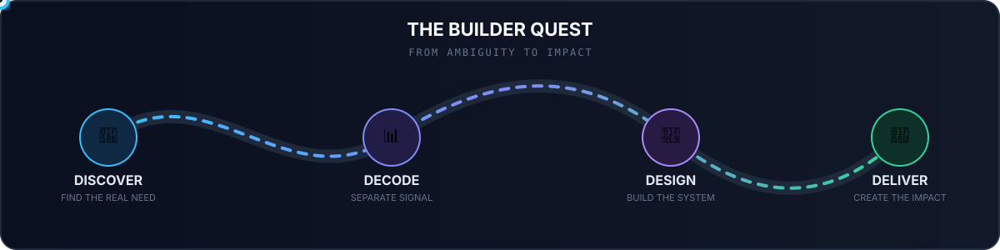

<div align="center">



</div>

## 🌐 Socials:

[](https://linkedin.com/in/amir-imtiaz-flm)
[](mailto:amirimtiazflm@gmail.com)
[](https://portfolio-amir-imtiaz.vercel.app)

<div align="center">


</div>

---

## 👋 About Me

```python
amir = {
    "focus": ["Product", "Artificial Intelligence", "Data"],
    "education": "Computer Information Systems & Technology + AI",
    "experience": ["NTTA", "Capital One", "180 Degrees Consulting", "CVS Health"],
    "building": "Meridian — AI-powered recruiting intelligence",
    "mission": "Build technology that creates measurable impact"
}
```

I'm a first-generation college student and technical product builder based in Dallas, Texas. I work at the intersection of **product strategy, artificial intelligence, data analytics, and software**, combining customer insight with technical execution to build products that solve real problems.

---

## 🚀 Featured Work

<table>
<tr>
<td width="50%" valign="top">

### 🧭 Meridian

**AI-powered recruiting intelligence**

A resume and job-description analysis platform designed to show candidates how their applications move through eligibility checks, ATS parsing, AI evaluation, and recruiter review.

**What it does**
- Simulates a multi-stage recruiting pipeline
- Produces recruiter-style scoring and feedback
- Translates rejection ambiguity into clear next steps

**Focus:** Product · AI · NLP · Recruiting Tech

[](https://portfolio-amir-imtiaz.vercel.app/work)

</td>
<td width="50%" valign="top">

### 🌎 Capital One Borderless

**International payments with an AI financial navigator**

A product concept built during Capital One's HACU Launchpad to make cross-border payments simpler, more transparent, and more accessible.

**Highlights**
- Designed an in-app international transfer experience
- Built the AI-powered **360 Navigator** concept
- Modeled a 10,000-user pilot and **$48M** in payment volume
- Earned **2nd place out of 10 teams**

**Focus:** Product Strategy · FinTech · AI · Financial Inclusion

[](https://portfolio-amir-imtiaz.vercel.app/work)

</td>
</tr>
<tr>
<td colspan="2" valign="top">

### 📦 Supply Chain Intelligence

**Operational data and decision support at NTTA**

Applied analytics to procurement and logistics operations during my Data Analyst internship at the North Texas Tollway Authority, supporting inventory visibility and the Sign Shop transition from Plano to Frisco.

**Focus:** Data Analytics · Supply Chain · Inventory Intelligence · Process Improvement

[](https://portfolio-amir-imtiaz.vercel.app/experience)

</td>
</tr>
</table>

---

## 💼 Experience

<table>
<tr>
<td width="20%" align="center" valign="top">
<br/>
<br/><br/>
<b>North Texas Tollway Authority</b><br/>
<sub><b>Data Analyst Intern</b></sub><br/><br/>
</td>
<td width="20%" align="center" valign="top">
<br/>
<br/><br/>
<b>Capital One</b><br/>
<sub><b>Launchpad Leadership Program Fellow</b></sub><br/>
<sub>Technology + Business Track</sub><br/><br/>
</td>
<td width="20%" align="center" valign="top">
<br/>
<br/><br/>
<b>IMC Trading</b><br/>
<sub><b>U.S. Chess Academy</b></sub><br/>
<sub>Qualifier &amp; Finalist</sub><br/><br/>
</td>
<td width="20%" align="center" valign="top">
<br/>
<br/><br/>
<b>180 Degrees Consulting</b><br/>
<sub><b>Strategy Consultant</b></sub><br/>
<sub>Project Team Lead</sub><br/><br/>
</td>
<td width="20%" align="center" valign="top">
<br/>
<br/><br/>
<b>CVS Health</b><br/>
<sub><b>Certified Pharmacy Technician</b></sub><br/><br/>
</td>
</tr>
</table>

---

## 🧰 Technical Toolkit

### Languages

<p>

</p>

`Python` · `Java` · `C++` · `C` · `JavaScript` · `TypeScript` · `R` · `SQL` · `HTML/CSS`

### Frameworks & Development

<p>

</p>

`React` · `Next.js` · `Node.js` · `Django` · `FastAPI` · `Flask` · `Vite` · `REST APIs` · `Vercel`

### Data, AI & Visualization

<p>

</p>

`Pandas` · `NumPy` · `Matplotlib` · `Plotly` · `Scikit-learn` · `OpenAI` · `PostgreSQL` · `MySQL` · `MongoDB` · `Power BI` · `Tableau` · `Excel`

### Cloud, Tools & Product Design

<p>

</p>

`AWS` · `Azure` · `Docker` · `Git` · `GitHub` · `Figma` · `Adobe` · `Notion` · `Postman` · `Linux` · `Windows Terminal` · `VS Code`

---

## 🧠 My Builder's Operating System

<div align="center">



<br/>

**Every build is a quest:** understand the person, decode the signal, design the system, and deliver an outcome that matters.

`AMBIGUITY` **→** `INSIGHT` **→** `SYSTEM` **→** `IMPACT`

</div>

---

## 🤝 Let's Connect

I'm drawn to opportunities where **AI, data, and genuine human insight** come together to untangle difficult problems, build intelligent systems, and create meaningful impact at scale.

### 🌐 Find Me Online:

[](https://linkedin.com/in/amir-imtiaz-flm)
[](mailto:amirimtiazflm@gmail.com)
<a href="https://portfolio-amir-imtiaz.vercel.app"></a>

<div align="center">

<br/>


</div>